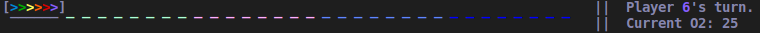
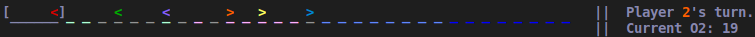
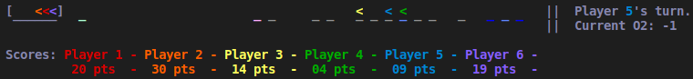
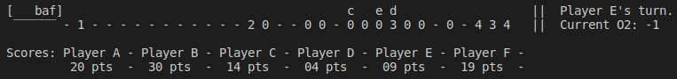

# DeepSeaAdventure

This is a gym environment for the boardgame Deep Sea Adventure by Oink Games. I do not own the rights to this game and am not affiliated to Oink Games, but I own a copy of the game and wanted to build this environment as part of a Reinforcement Learning course. <br>
https://oinkgames.com/en/games/analog/deep-sea-adventure/

## Installation
```
cd gym-DeepSeaAdventure-v0
pip install -e .
```

You can then use the environment in your projects as follows:
```
import gym
env = gym.make('gym_DeepSeaAdventure:DeepSeaAdventure-v0')
```

## Rules
### Initial setup
In this game, 2 to 6 players to compete to acquire treasures with a shared limited oxygen supply. The main game board is made of a submarine and 32 treasure tiles. Each treasure tile has a hidden value and a visible number of dots between 1 and 4.
The value distribution is as follows:
  - 1 dot: [0 to 3, twice each]
  - 2 dots: [4 to 7, twice each]
  - 3 dots: [8 to 11, twice each]
  - 4 dots: [12 to 15, twice each]
  
The treasures are grouped by dot level and shuffled within their group. Each group is then placed to form a linear path from 
low to high dot count, starting with the 1-dot treasures at the submarine.
The oxygen counter is initialized at 25 and all players are placed in the submarine, facing forward.
The players then take turns until the oxygen runs out, or all players make it back safely to the submarine.

### Turn order
Taking turns in clockwise order, each player does the following actions:
  1. Decrease the shared oxygen counter by the number of treasures they currently hold
  2. Decide if they will proceed deeper or turn towards the submarine. Players can only turn around once per round.
  3. Roll two three-sided dice (a six-sided die with numbers {1, 2, 3, 1, 2, 3}), add the values together and subtract the number of treasures they currently hold.
  4. Move in the direction they face a number of step given by the total obtained in 3. If another player is in their path, the moving player leaps to the next available tile in a single step.
  5. After performing their last step, the player decides to perform one of the following three actions:<br>
    5a. Do nothing.<br>
    5b. If they land on a treasure, they can pick it up without looking at its hidden value and replace it by a blank tile. This tile is now a part of the path, but can't be picked up by other players.<br>
    5c. If they land on a blank tile, they can drop one of their treasures to replace it. This lowers their weight and oxygen consumption.
 

### End of round
When a player makes it back to the submarine safely, they skip their turn until the end of the round. 
If the oxygen counter is at 0 before a player starts their turn, or if all players make it back to the submarine, the round ends.
The following steps happen:
  1. Players who made it back safely reveal their collected treasures and the values to their point total. These treasures can be removed from the game.
  2. Players who drowned drop the treasures they collected this round and make no points.
    2*. In the normal game, players form stacks of discarded treasures at the end of the trail. For simplicity, this sub-step is not included in this environment.
  3. All blank tiles are removed from the path, shortening the distance to high value treasures.

If all players make it back before the oxygen runs out, the last player in the submarine starts the following round.
If a least one player drowned, the player furthest from the submarine starts the following round. Play is continued clockwise. 
The game is played for 3 rounds, and the player with the most points wins.

### A few additional notes
- Treasures acquired in previous rounds do not affect weight and oxygen consumption.
- When reaching the end of the trail, a player stops moving but they don't have to turn around.
- If a player is on the last tile of the trail, the next viable tile is the second to last and so on.


## Details about the environment

### Actions
The end-of-round action of making new stacks of treasures after drowning is omitted for simplicity. This simplifies the game to 3 binary decisions:
  1. Should I turn around?
  2. Should I pick up the tile I'm on?
  3. Should I drop one of my tiles?

To represent this, 3 separate binary action spaces are used by the environment.

  - Forward: 1 to proceed forward or 0 to turn around. This action is used every turn until the player turns around each round
  - Pick: 1 to pick the tile the player is on or 0 to ignore it. This action is used when the player stops on a treasure tile.
  - Drop: 1 to drop the lowest dot treasure currently owned or 0 to ignore. This action is used then the player stops on a blank tile while holding at least one treasure.
  

### State
A Discrete state made of 83 integer values is used to describe the state. The value represented by each index is as follows:

  - 0: Oxygen level [0-25]
  - 1: Position [0-32]<br>
    0 is the submarine<br>
    [1-32] represent each of the 32 treasures in the path
  - 2: Weight [0-6]<br>
    The number of treasures the player is currently holding
  - 3: Direction [0-1]<br>
    The direction the player is facing: forward [1] or backward [0]
  - 4 to 8: Positions of other players [0-32]<br>
    Similar to 1 but for other players.<br>
    If there are less than 6 players, the unneeded positions are set to 0
  - 9 to 13: Weights of other players [0-32]<br>
    Similar to 2 but for other players.<br>
    If there are less than 6 players, the unneeded weights are set to 0
  - 14 to 18: Directions of the other players [0-1]<br>
    Similar to 3 but for other players.<br>
    If there are less than 6 players, the unneeded directions are set to 0
  - 19 to 50: Number of dots for each of the 32 tiles [0-4]<br>
    Blank tiles and tiles that have been removed in a previous round have a dot value of 0.
  - 51 to 82: Weither each of the 32 tiles will be skipped [0-1].<br>
    A tile is skipped if it was removed in a previous round, or if there is a player sitting on it.
    
    
### Initialization
Once initialized, players must be added to the environment before calling ```env.reset()```.<br>
Players are created using a policy with the ```Player``` class in ```env.py```. Basic policies are provided in ```policy.py```:

```
env = DSA_env()
env.seed(42)

player1 = Player(Grabber(1))
player2 = Player(Diver(16, 1))
player3 = Player(Greedy())
player4 = Player(Randy())

env.add_player(player1)
env.add_player(player2)
env.add_player(player3)
env.add_player(player4)

env.reset()
```

New policies can be created as childs of ```Policy()``` in ```policy.py``` and must include the three binary policies ```forward, pick & drop```.
These three binary policies are called when needed by the environment during ```env.step()```

### Render
By default, ```render()``` assumes that the terminal used accepts ANSI escape codes for formatting. If this isn't the case, ```colors=False``` must be specified. 
To display the current episode count, ```episode=i``` can be used.


The submarine is represented by ```[______]```. Each colored chevron represents the position and direction each player is facing (```>``` for forward and ```<``` for backward).
The colored dashes represent the treasures, from 1 to 4 dots. A gray dash represents a blank tile. The absence of dash means that the tile was picked in a previous round and is now removed.<br>
The current player and oxygen meter are presented on the right. The final scores for all players are displayed after the third round.<br>




When ```render(colors=False)``` is used, the chevrons are replaced by letters ```A-F```. Upper case letters represent players moving forward,
and lower case letters represent players that turned around. The numbers ```1-4``` represent dotted treasure tiles, and ```0``` is used to represent a blank tile.
The ```-``` symbol means that the tile was picked in a previous round and is now removed.




  
